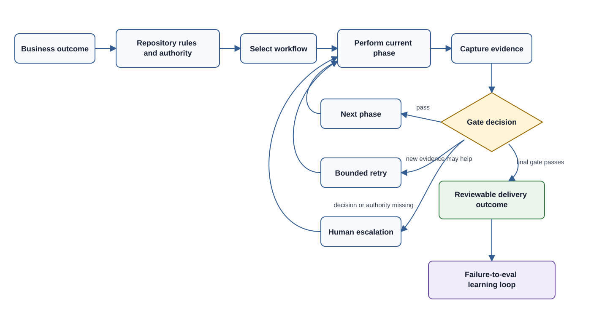

# Agentic Work Operating Model

## Executive Summary

This repository is an operating kit for turning AI-assisted software development from an informal chat interaction into a controlled, repeatable way of working.

It gives an organization a shared library of engineering skills, bounded agent roles, executable workflows, validation gates, and evaluation scenarios. Together, these components let an AI coding agent perform meaningful multi-step work while remaining accountable to repository rules, human authority, and observable evidence.

The business goal is not to remove people from software delivery. The goal is to let people assign larger outcomes to agents without losing control over scope, quality, security, or decision ownership.

## The Business Problem

Basic coding assistants are useful for isolated tasks, but organizations encounter predictable problems when they attempt to give them broader responsibility:

- Each request starts from scratch and depends on the prompt quality of one person.
- Agents begin implementation before understanding the repository or expected behavior.
- Testing, security review, documentation, and release checks are applied inconsistently.
- Long-running work loses context between sessions or agents.
- Review conclusions are difficult to audit because evidence is scattered through chat history.
- Agent capabilities are confused with authorization to merge, deploy, change work items, or modify external systems.
- Failures are corrected once but do not become reusable organizational learning.

These problems make agent performance difficult to trust, compare, govern, and scale.

This repository addresses them by treating agentic development as an operating system with explicit work definitions, transitions, evidence, and controls.

## The Business Value

The repository is intended to produce five organizational outcomes.

### More Work Completed Per Human Decision

A person can provide an outcome and constraints, then allow the agent to move through discovery, planning, implementation, validation, and review. Human attention is reserved for ambiguous product decisions, elevated risk, missing authority, and final acceptance.

### Consistent Engineering Practice

Reusable skills encode how common work should be performed. Workflows compose those skills into repeatable delivery patterns. Teams no longer need to restate the same expectations for source inspection, testing, review, release readiness, or handoff in every prompt.

### Visible And Auditable Progress

Each workflow run has durable state. The current phase, responsible role, permission boundary, required evidence, attempts, blockers, and decisions are recorded outside chat history. A reviewer can determine what happened and why a phase was allowed to advance.

### Controlled Autonomy

The system distinguishes between what an agent is capable of doing and what it is authorized to do. Read-only analysis, validation, workspace changes, and external mutations are separate permission classes. External actions remain subject to explicit human or repository authorization.

### Continuous Improvement

Repeated agent failures can be converted into evaluation scenarios. This changes the response from “write a better prompt next time” to “add a regression check that improves the operating system for everyone.”

## What The Repository Provides

The repository has several layers, each serving a different business purpose.

| Layer | Business purpose |
| --- | --- |
| Skills | Standard operating procedures for individual engineering capabilities. |
| Workflows | Repeatable delivery paths for features, bugs, reviews, releases, data changes, dependencies, and delivery platforms. |
| Workflow manifests | Executable contracts defining phase ownership, permissions, evidence, retry limits, and approval boundaries. |
| Subagents | Isolated discovery, validation, and review roles with conservative permissions. |
| Target-repository instructions | Project-specific commands, architecture boundaries, forbidden changes, and authorization rules. |
| Run state and handoffs | Durable records that allow work to pause, transfer, and resume without relying on chat memory. |
| Evaluations | Regression coverage for expected agent behavior and safety boundaries. |
| Bundles and harness profiles | Repeatable installation for different repositories and agent tools. |

The repository does not provide unrestricted autonomous execution. It does not independently grant access, approve business decisions, bypass policies, or remove the need for accountable review.

## How Agentic Work Operates

Agentic work uses a closed control loop:

The agent decides how to perform the current phase using repository context and the named skill. The workflow runtime decides whether the recorded evidence is sufficient to move to the next phase. The person or target repository remains the authority for business decisions and external changes.

This separation makes autonomy bounded and inspectable.

## The Standard Operating Model

### 1. Define The Outcome

The request should describe the desired result, relevant constraints, and any known acceptance criteria. It does not need to prescribe every implementation step.

Examples:

- Add a customer export capability without changing the existing API contract.
- Diagnose a recurring build failure and provide a verified fix.
- Review a schema migration for deploy and rollback risk.
- Prepare a release candidate, but do not deploy it.
- Convert a repeated agent failure into regression coverage.

### 2. Apply Project Context

The target repository's `AGENTS.md` supplies the local operating boundaries: setup and validation commands, architecture notes, sensitive areas, forbidden changes, and actions requiring approval.

Reusable guidance belongs in this skill repository. Project-specific facts remain in the target repository. This avoids creating organization-wide skills that accidentally encode one application's assumptions.

### 3. Select The Workflow

The agent or operator selects the workflow that best matches the outcome. Small local changes may stay in a solo implementation mode. Cross-cutting, risky, or long-running work should use a durable workflow run.

The selected workflow defines the expected sequence. For example, a feature quality loop moves through source-backed requirements, planning, test strategy, implementation, independent validation, independent review, and final handoff.

### 4. Execute One Phase At A Time

Only the current phase is active. Its contract names:

- the responsible skill, main agent, or subagent
- the maximum permission for the phase
- the expected output
- the evidence needed to advance
- the retry limit

This reduces the risk of an agent performing implementation, review, release, and external updates as one unstructured action.

### 5. Advance On Evidence

The agent records concrete evidence such as source files inspected, acceptance criteria, changed files, validation commands, exit codes, review findings, rollback plans, or authorization records.

The runtime rejects a transition when required evidence is absent. A prose claim that work is “done” is not a substitute for a satisfied gate.

### 6. Escalate Decisions, Not Routine Work

The agent should continue independently when repository inspection or bounded validation can answer a question. It should pause when progress requires:

- a product decision between incompatible behaviors
- authority for an external or destructive action
- credentials or protected access
- acceptance of material security or release risk
- resolution of contradictory sources of truth

The run resumes at the same phase after the decision is recorded.

### 7. Hand Off A Reviewable Outcome

Completed or paused work produces a durable handoff containing the objective, phase state, evidence, blockers, decisions, risks, and exact next action. Another person or agent can resume without reconstructing the task from chat history.

## Common Business Use Cases

| Business need | Recommended operating pattern | Business control |
| --- | --- | --- |
| Deliver a scoped feature | Feature development or feature quality loop | Source-backed acceptance criteria and validation before review. |
| Resolve an unreliable defect | Bug reproduction followed by bug diagnosis | Reproduction evidence before implementation. |
| Change an API or service | Backend change loop | Contract and security review before handoff. |
| Modify schemas or data workflows | Data change loop | Migration, rollback, security, and release review. |
| Upgrade dependencies or runtimes | Dependency upgrade loop | Compatibility, CI, validation, and security checks. |
| Review a proposed change | Pull-request review | Read-only findings tied to concrete evidence. |
| Prepare a release | Release preparation or release gate loop | Validation, documentation, rollback, security, and readiness gates. |
| Operate GitHub or Azure DevOps delivery | Platform-specific lifecycle workflow | Explicit authority and required policy checks before external mutation. |
| Improve the agent system | Agent skill quality or failure-to-eval loop | Validation and regression coverage before publication. |

## Roles And Accountability

| Role | Accountability |
| --- | --- |
| Business or product owner | Defines desired outcomes and resolves product ambiguity. |
| Engineering owner | Owns architecture, repository rules, validation expectations, and acceptance of technical risk. |
| Main agent | Executes the current phase, maintains scope, records evidence, and produces the final conclusion. |
| Reviewer subagent | Performs an isolated read-only or validation-only assessment and reports findings. |
| Workflow owner | Maintains workflow intent, manifests, evidence gates, and approval boundaries. |
| Skill library maintainer | Curates reusable skills, bundles, metadata, validation, and evaluation coverage. |
| Release or security authority | Approves elevated risk and authorized external actions where required. |

The main agent remains accountable for integrating subagent results. Delegation does not transfer final responsibility or expand authority.

## Governance Model

### Repository-Level Governance

Each target repository should define:

- supported setup, test, lint, build, and validation commands
- important architecture and ownership boundaries
- sensitive code and data areas
- generated or forbidden files
- required security and release checks
- conditions for creating branches, pull requests, work items, releases, or deployments

### Workflow-Level Governance

Each executable workflow declares:

- mutation level
- phase permissions
- approval boundaries
- required evidence
- retry limits
- escalation and stopping behavior

### Organizational Governance

Organizations should decide:

- which repositories may use agentic workflows
- which workflow classes may run without prior approval
- who may authorize external mutations
- where workflow state and handoffs may be stored
- what evidence must be retained
- which failures require new evaluation coverage
- how skill and workflow changes are reviewed and promoted

## Adoption Path

### Stage 1: Establish A Safe Baseline

Install the starter bundle in one representative repository. Complete its `AGENTS.md`, identify reliable validation commands, and begin with feature development, bug diagnosis, and pull-request review.

Keep external mutations outside the initial pilot.

### Stage 2: Run A Controlled Pilot

Choose recurring, bounded work with observable outcomes. Track where the agent escalates, where evidence gates block weak work, and where project context is missing.

Suitable pilot work includes focused feature changes, deterministic bug fixes, test improvements, and read-only reviews.

### Stage 3: Add Domain Workflows

Add backend, frontend, data, security, delivery, or platform-specific bundles only where those patterns repeat. Update repository instructions rather than compensating with longer prompts.

### Stage 4: Introduce Independent Agent Roles

Use subagents at clear phase boundaries for repository discovery, test strategy, validation, code review, security review, architecture review, and release readiness. Avoid delegation when coordination cost exceeds the risk reduction.

### Stage 5: Build The Learning Loop

Review recurring failures and convert the important ones into eval scenarios. Promote workflows and skills based on representative evidence rather than anecdotal success.

### Stage 6: Expand Authorized Automation

Only after local execution is reliable should the organization consider guarded PR, issue, work-item, CI, release, or deployment actions. Preserve explicit authority and platform policies at every external boundary.

## Measuring Success

Measure the operating model rather than raw code generation volume.

Useful indicators include:

- lead time from assigned outcome to review-ready change
- percentage of workflow runs completed without avoidable human intervention
- number and type of escalations per workflow
- validation pass rate before human review
- review findings by severity and recurrence
- rework caused by missing context or misunderstood requirements
- percentage of handoffs that can be resumed without additional explanation
- release or security gates caught before external action
- repeated failures converted into eval coverage
- skill and workflow validation and maturity trends

Higher autonomy is valuable only when quality, traceability, and risk remain acceptable.

## What Good Agentic Work Looks Like

A healthy workflow run has these characteristics:

- The objective and acceptance criteria are clear.
- The agent inspects source before changing it.
- Only the current phase is performed.
- Permissions are narrower than or equal to the granted authority.
- Evidence is concrete and proportionate to risk.
- Retries introduce new evidence or a narrower approach.
- Human involvement occurs at decision boundaries rather than every implementation step.
- Review and validation are independent when the risk warrants it.
- The handoff is sufficient for another person or agent to continue.
- A repeated failure improves the shared system.

## Getting Started

For a first organizational pilot:

1. Select one target repository with reliable tests and an accountable engineering owner.
2. Install the `starter` bundle and complete the target-repository `AGENTS.md`.
3. Choose one recurring feature or bug workflow.
4. Start a durable workflow run and require evidence-backed transitions.
5. Review the final handoff alongside the resulting code change.
6. Record missing context, unnecessary escalations, and weak gates.
7. Improve the repository instructions, skill, workflow, or eval that owns each failure.
8. Expand to additional repositories only after the pilot produces repeatable outcomes.

Technical operating instructions are in the [Agentic Workflow Guide](agentic-workflow-guide.md). Workflow composition and subagent guidance are in the [Orchestration Guide](orchestration-guide.md) and [Subagent Orchestration Guide](subagent-orchestration-guide.md).
