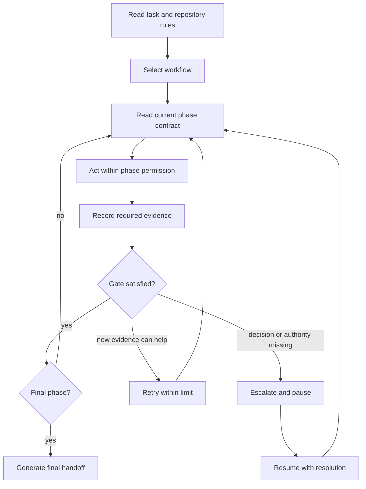

# Agentic Workflow Guide

## Purpose

This guide explains how to run this repository's workflows as gated, durable state machines. It is for developers and agents using the cloned operating kit or an installed `agentic-workflow-runtime` skill.

The runtime separates responsibilities:

- The agent interprets source, plans work, edits files, delegates bounded review, and evaluates results.
- The workflow manifest declares phase order, ownership, permissions, evidence gates, retry limits, and approval boundaries.
- The runner persists state and refuses invalid transitions.
- The target repository's `AGENTS.md` supplies project-specific commands, constraints, and authorization rules.

The runner does not execute implementation, invoke subagents, or authorize external actions. It makes the agent's control loop explicit and resumable.

## Prerequisites

From this repository, validate the runtime:

```powershell
.\scripts\run-agent-workflow.ps1 -Action Validate
.\scripts\test-workflow-runner.ps1
```

Linux requires PowerShell 7. WSL may use the installed Windows PowerShell fallback:

```bash
bash ./scripts/run-agent-workflow.sh -Action Validate
pwsh -NoLogo -NoProfile -File ./scripts/test-workflow-runner.ps1
```

When using an installed skill, run `scripts/run-agent-workflow.ps1` from the installed `agentic-workflow-runtime` skill directory.

## The Agentic Control Loop



This is agentic because the system observes state, chooses bounded work, acts, evaluates evidence, and changes course. It is controlled because phase transitions and permissions are explicit.

## Quick Start

### 1. Select A Workflow

```powershell
.\scripts\run-agent-workflow.ps1 -Action Select -Task "Implement a tested API feature with independent review"
```

Selection returns up to three candidates with matched keywords, mutation level, and whether confirmation is needed. Use the suggested workflow only when it matches the request and target-repo rules.

List every executable workflow:

```powershell
.\scripts\run-agent-workflow.ps1 -Action List
```

### 2. Start A Durable Run

```powershell
.\scripts\run-agent-workflow.ps1 `
  -Action Start `
  -Workflow feature-quality-loop `
  -Objective "Add CSV export with focused tests" `
  -ProjectPath C:\work\example-project
```

`Start` prints the run-state path and the first phase contract. By default, run state is outside the source repository under the operating system's local application-data directory. Supply `-StateRoot` when an organization has a dedicated state location.

Save the printed path for later commands:

```powershell
$RunPath = "<run-state-path>"
```

Automatic start by task is permitted only for an unambiguous positive match:

```powershell
.\scripts\run-agent-workflow.ps1 -Action Start -Task "Diagnose a failing test regression" -ProjectPath C:\work\example-project
```

### 3. Execute The Current Phase

Inspect the contract whenever work resumes:

```powershell
.\scripts\run-agent-workflow.ps1 -Action Status -RunPath $RunPath
```

The contract provides:

- owner type and name
- permission boundary
- instructions and expected output
- required and missing evidence
- current attempt and retry limit

Load only the named skill or delegate only to the named subagent. The main agent remains responsible for final conclusions and all edits.

### 4. Record Evidence And Advance

Record concrete evidence after completing the phase:

```powershell
.\scripts\run-agent-workflow.ps1 -Action Record -RunPath $RunPath -EvidenceName source-files -EvidenceValue "src/export.ps1; tests/export.tests.ps1"
.\scripts\run-agent-workflow.ps1 -Action Record -RunPath $RunPath -EvidenceName acceptance-criteria -EvidenceValue "Export includes active records and emits UTF-8 CSV"
.\scripts\run-agent-workflow.ps1 -Action Advance -RunPath $RunPath
```

The runner rejects `Advance` if any declared evidence is absent and leaves the current phase unchanged. Evidence should be concise and reviewable:

- file paths
- commands and exit codes
- validation summaries
- review findings and disposition
- explicit authorization records
- decisions, risks, and rollback plans

Do not use placeholders such as `done` or `looks good`. Do not store credentials, private logs, personal data, or large command output.

## Retry, Escalation, And Recovery

Retry only when another attempt has a reason to produce a different result:

```powershell
.\scripts\run-agent-workflow.ps1 -Action Retry -RunPath $RunPath -Reason "Corrected the invalid fixture setup"
```

Retry clears the current phase's evidence by default. Use `-PreserveEvidence` only when the prior evidence remains valid. A manifest's retry limit prevents open-ended loops.

Pause for a missing decision, approval, credential, or authoritative source:

```powershell
.\scripts\run-agent-workflow.ps1 -Action Escalate -RunPath $RunPath -Reason "Product decision required for response compatibility"
```

After the decision is supplied:

```powershell
.\scripts\run-agent-workflow.ps1 -Action Resume -RunPath $RunPath -Resolution "Preserve the response and add an optional field"
```

The resolution is attached to the blocker history and the run resumes at the same phase.

Each run stores a snapshot of the selected manifest. A later catalog or manifest edit therefore does not change the phase contract of work already in progress. Start a new run when the updated workflow should apply.

## Handoffs And Context Continuity

Generate a handoff before changing agents, ending a long session, or asking the user to resolve a blocker:

```powershell
.\scripts\run-agent-workflow.ps1 -Action Handoff -RunPath $RunPath
```

The Markdown handoff is written beside the JSON state and contains:

- objective and workflow
- completed and pending phases
- recorded evidence
- open and resolved blockers
- risks
- exact next action

A fresh agent should read the handoff, inspect the run with `Status`, and continue the displayed phase. It should not reconstruct state from chat memory. State updates use a temporary file and replacement write so a partial process failure does not leave half-written JSON.

## Permissions And Authorization

Manifest permissions describe the maximum action class for a phase:

| Permission | Meaning |
| --- | --- |
| `read-only` | Inspect and report; do not edit files or external state. |
| `validation-only` | Run safe validation; do not edit source or dependencies. |
| `workspace-write` | Edit the target workspace within the request and repository rules. |
| `external-mutation` | An external change may be part of the phase, but only with explicit authority. |

Permissions do not grant authority. User instructions and target-repository rules may narrow them further. External delivery workflows require `authorization-evidence` at the relevant gate and prohibit policy bypass.

## Subagent Operation

Subagent phases are isolation and review boundaries, not general permission to parallelize. When a phase owner is a subagent:

1. Provide the current phase objective, inputs, allowed actions, forbidden actions, required evidence, and escalation conditions.
2. Keep the subagent read-only or validation-only as declared.
3. Record the compact result as phase evidence.
4. Keep final edits and the phase transition with the main agent.

If the harness has no native subagent support, execute the same role as an isolated review pass in the main conversation and record that limitation.

## JSON Output For Automation

All actions support `-OutputFormat Json`:

```powershell
$status = .\scripts\run-agent-workflow.ps1 -Action Status -RunPath $RunPath -OutputFormat Json | ConvertFrom-Json
$status.current_phase_contract.missing_evidence
```

Automation may use JSON to present the phase contract, but should not fabricate evidence or automatically authorize mutations.

## Authoring Or Changing Workflows

Human-readable workflow intent remains under `workflows/`. Executable contracts live with the runtime skill under `skills/agentic-workflow-runtime/references/workflow-manifests/` and are indexed by `catalog/workflows.tsv`.

When adding or changing a workflow:

1. Update the Markdown workflow.
2. Add or revise its JSON manifest.
3. Keep `catalog/workflows.tsv` and the skill's `references/workflows.tsv` aligned.
4. Give every phase one owner, one permission, an observable output, required evidence, and a bounded retry limit.
5. Add approval boundaries for destructive, credentialed, security-sensitive, or external operations.
6. Add an eval scenario when the change prevents a repeated behavior failure.
7. Run repository validation and the focused runtime test.

The JSON contract is defined in `skills/agentic-workflow-runtime/references/workflow-manifest.schema.json`.

## Validation

Windows:

```powershell
.\scripts\run-agent-workflow.ps1 -Action Validate
.\scripts\test-workflow-runner.ps1
.\scripts\validate-skills.ps1
.\scripts\validate-evals.ps1
```

Linux:

```bash
bash ./scripts/run-agent-workflow.sh -Action Validate
pwsh -NoLogo -NoProfile -File ./scripts/test-workflow-runner.ps1
./scripts/validate-skills.sh
./scripts/validate-evals.sh
```
